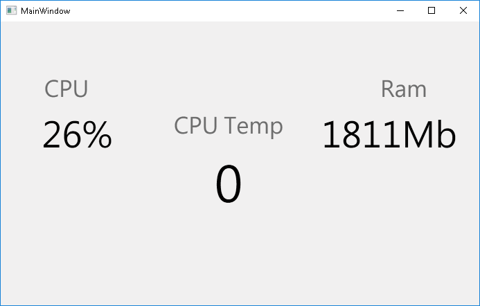

### About project

Following app let user see usage of CPU , RAM and CPU Temp with use of OpenHardwareMonitor.dll library and C# .NET framework with WPF.

### Features

* Shows CPU usage
* Show Memory usage in Mb
* Show CPU Temp. Note : Not all sensors are supported by WMI(Windows Management Instrumentation)
